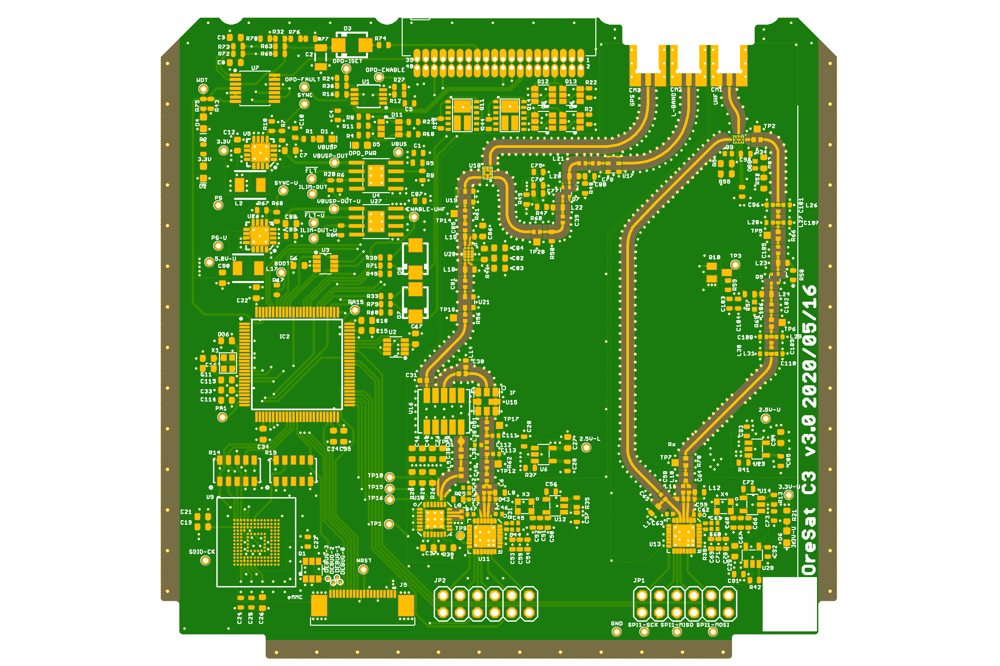

# oresat-c3
## General information
This is the C3 (Command, Communication, and Control) card for OreSat. It
acts as the central control point for the entire OreSat project. It
provides a communication link to the ground via dual AX5043 radios,
providing a telecommand and telemetry interface.

Further documentation can be found in the [doc](doc) folder.

## Prototype Breadboard
The current breadboard prototype for the C3 card implements an
STM32F446RE development board connected to two SPI radios, the OreSat
FlatSat backplane via a CAN transceiver and I2C for the OPD interface,
and a SDIO and SPI connected SD/MMC Card. The breadboard implements
stronger pullups for the I2C lines than the GPIO of the STM32 can
provide. It is currently capable of interfacing with and activating the
OPD connected boards.

## Capstone Project
The current Revision 3 for the C3 card implements an
STM32F446VET6 development board schematic. Has has limited testing. It is 
currently capable of interfacing with and activating the OPD connected
boards as previous models could.

Further Documentation for the Capstone project, available here:
[oresat C3 docs](https://drive.google.com/open?id=1Un2p3h_Q7atn-QL2-gCIlfyMp1jt3sK1)

## Firmware
The firmware for the C3 card is integrated into the
[oresat-firmware](https://github.com/oresat/oresat-firmware) repository.
This is because the OreSat project is a tightly integrated system with
several common libraries and multiple subsystems working concurrently.
Specifically, the firmware application for this project is located
[here](https://github.com/oresat/oresat-firmware/tree/c3_capstone/src/f4/app_c3_v1).

## License
OreSat C3 is licensed under the CERN OHL v1.2. A copy of the license is
located in [here](LICENSE.md)
